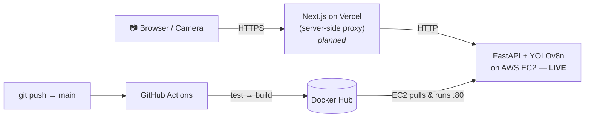

# PPE Safety Detection 🦺

> Real-time **hard-hat compliance detection** for worksite imagery. A YOLOv8
> model locates every person's head and decides whether a **helmet** is worn
> (compliant ✅) or **missing** (violation ⚠️), served through a containerized
> FastAPI backend deployed on AWS.

<p>
  
  
  
  
  
  
</p>

**🔴 Live API:** `http://13.205.125.147/docs` — interactive Swagger UI, running on AWS EC2.

---

## ✨ Highlights

- **Two-class safety model** — `helmet` (compliant) vs `head` (no helmet = violation), so every prediction maps directly to a compliance decision.
- **Strong accuracy** — **mAP@50 = 0.973**, precision **0.95**, recall **0.93** on the held-out test split (details below).
- **Production API** — FastAPI with a warm-loaded model, typed Pydantic responses, health checks, and request logging.
- **Bounding boxes + confidence** — `/predict` returns pixel-space boxes ready to draw over an image or a live camera frame.
- **Fully containerized** — slim CPU-only Docker image (`docker/Dockerfile`), runs on a 1 GB free-tier EC2 instance.
- **Automated CI/CD** — GitHub Actions runs **tests → builds the image → pushes to Docker Hub → EC2 pulls & redeploys** on every push to `main`.
- **Reproducible ML** — DVC-versioned dataset (DagsHub remote), MLflow-logged training runs, and a per-class evaluation script that writes `models/metrics.json`.

---

## 🏗️ Architecture



The planned frontend talks to the backend through a **Next.js server-side proxy**,
so the browser only ever calls Vercel over HTTPS — no mixed-content and no CORS
changes needed on the HTTP backend.

---

## 📊 Model performance

YOLOv8n, evaluated on the **test** split (`python -m ppe_detector.evaluation.metrics`):

| Class       | Precision | Recall | mAP@50 | mAP@50-95 |
|-------------|:---------:|:------:|:------:|:---------:|
| **Overall** | **0.947** | **0.934** | **0.973** | **0.662** |
| `helmet`    | 0.960     | 0.936  | 0.981  | 0.666     |
| `head`      | 0.935     | 0.931  | 0.965  | 0.658     |

_Source of truth: [`models/metrics.json`](models/metrics.json)._

---

## 🧰 Tech stack

| Layer            | Tools                                                       |
|------------------|-------------------------------------------------------------|
| Model            | Ultralytics **YOLOv8n**, PyTorch (CPU)                       |
| Serving          | **FastAPI**, Uvicorn, Pydantic v2, Pillow                   |
| Containerization | **Docker** (python:3.11-slim, CPU-only torch)              |
| CI/CD            | **GitHub Actions** → Docker Hub → AWS EC2 (SSH)            |
| Data / tracking  | **DVC** (DagsHub remote), **MLflow**                        |
| Testing          | **pytest** (unit + integration)                            |
| Frontend _(planned)_ | **Next.js** on **Vercel**                              |

---

## 📁 Project structure

```
ppe-safety-detection/
├── api/                          # FastAPI inference service
│   ├── main.py                   # app entrypoint (CORS, lifespan warm-load)
│   ├── dependencies.py           # PPEDetector singleton (env-configured)
│   ├── routers/predict.py        # GET /health, POST /predict
│   ├── schemas/prediction.py     # Pydantic request/response models
│   └── middleware/logging.py     # request logging
├── src/ppe_detector/             # installable package (src layout)
│   ├── data/                     # loader, augmentation, validation
│   ├── models/                   # train.py (MLflow), model registry
│   ├── evaluation/metrics.py     # per-class eval → models/metrics.json
│   └── inference/                # predictor.py, postprocess.py
├── configs/                      # data / model / train YAML configs
├── models/                       # best.pt (committed) + metrics.json
├── data/                         # dataset, DVC-tracked (DagsHub remote)
│   └── raw.dvc
├── docker/Dockerfile             # CPU-only image for the API
├── tests/                        # pytest unit + integration
├── docs/                         # architecture.md, model_card.md
├── scripts/                      # dataset-prep utilities
├── .github/workflows/deploy.yml  # CI: test → build → push → deploy
├── requirements.txt              # slim runtime dependencies
└── pyproject.toml                # package metadata + dev deps
```

---

## 🔌 API reference

| Method | Endpoint   | Description                                   |
|--------|------------|-----------------------------------------------|
| GET    | `/health`  | Service + model status, loaded class names    |
| POST   | `/predict` | Upload an image → detections + summary        |

**`POST /predict`** — `multipart/form-data`, field `file` (any `image/*`):

```bash
curl -X POST http://13.205.125.147/predict \
  -F "file=@worksite.jpg"
```

**Response** — boxes are `[x1, y1, x2, y2]` in pixels of the uploaded image:

```json
{
  "filename": "worksite.jpg",
  "detections": [
    { "label": "helmet", "confidence": 0.94, "bbox": [220.5, 88.1, 305.7, 176.4], "violation": false },
    { "label": "head",   "confidence": 0.88, "bbox": [512.0, 120.3, 590.2, 205.9], "violation": true }
  ],
  "summary": {
    "total": 2,
    "counts": { "helmet": 1, "head": 1 },
    "violation_count": 1,
    "compliant": false
  }
}
```

`compliant` is `true` only when `violation_count == 0`. Anything labelled `head`
(a person with no helmet) is flagged as a violation.

---

## 🚀 Quickstart (local)

### 1. Environment

```bash
python -m venv venv
source venv/bin/activate            # Windows: venv\Scripts\activate
pip install -r requirements.txt
```

### 2. (Optional) Pull the dataset

The trained model (`models/best.pt`) is committed, so you can run the API and
inference **without** the dataset. To reproduce training/evaluation, fetch the
DVC-tracked data from the DagsHub remote:

```bash
dvc pull                            # downloads data/raw/ (images + labels)
```

### 3. Run the API

```bash
PYTHONPATH=src uvicorn api.main:app --reload --port 8000
# Swagger UI → http://localhost:8000/docs
```

### 4. Run the tests

```bash
PYTHONPATH=".:src" python -m pytest -q
```

---

## 🐳 Docker

```bash
docker build -f docker/Dockerfile -t ppe-api .
docker run -p 8000:8000 ppe-api
# → http://localhost:8000/docs
```

The image installs **CPU-only** torch, runs a single Uvicorn worker as a
non-root user, and ships a `HEALTHCHECK` against `/health`.

---

## 🧪 Reproduce training & evaluation

**Train** (reads [`configs/train_config.yaml`](configs/train_config.yaml), logs to MLflow):

```bash
PYTHONPATH=src python -m ppe_detector.models.train
```

**Evaluate** (writes per-class metrics to `models/metrics.json`):

```bash
PYTHONPATH=src python -m ppe_detector.evaluation.metrics \
  --weights models/best.pt \
  --data data/raw/data.yaml \
  --split test
```

---

## 🚢 Deployment (CI/CD → AWS EC2)

Every push to `main` triggers [`.github/workflows/deploy.yml`](.github/workflows/deploy.yml):

1. **test** — install deps + run `pytest` (build/deploy are gated on this passing).
2. **build-and-push** — build the Docker image and push to Docker Hub (`:latest` + `:<sha>`).
3. **deploy** — SSH into EC2, `docker pull`, and restart the container on port `80`.

Required GitHub Actions secrets:

| Secret | Purpose |
|--------|---------|
| `DOCKERHUB_USERNAME`, `DOCKERHUB_TOKEN` | push/pull the image |
| `AWS_EC2_HOST`, `AWS_EC2_USER`, `AWS_EC2_SSH_KEY` | SSH deploy to the instance |

> On a 1 GB free-tier instance, add a 2–4 GB swap file so PyTorch can load the
> model without the OOM killer stepping in.

---

## 🗺️ Roadmap

- [ ] **Frontend** (Next.js on Vercel): drag-and-drop **image upload** + **live webcam** detection, drawing green boxes for helmets and red boxes for bare heads with confidence scores — via a server-side proxy to this API.
- [ ] Add the Vercel domain to the backend CORS allow-list (or keep everything behind the proxy).
- [ ] Optional GPU inference path for higher-throughput / video streams.

---

## 🏷️ Classes & violation rule

| Class    | Meaning              | Compliance     |
|----------|----------------------|----------------|
| `helmet` | Head **with** helmet | ✅ Compliant   |
| `head`   | Head **without** helmet | ⚠️ **Violation** |

The violation rule lives in a single place —
[`VIOLATION_LABELS`](src/ppe_detector/inference/postprocess.py) — so adding more
PPE checks later (e.g. vests) is a one-line change.

---

## 📚 Docs

- [`docs/architecture.md`](docs/architecture.md) — system design
- [`docs/model_card.md`](docs/model_card.md) — model card
